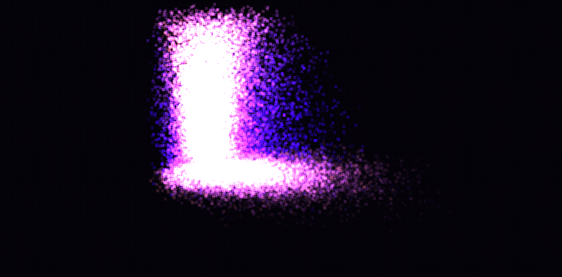
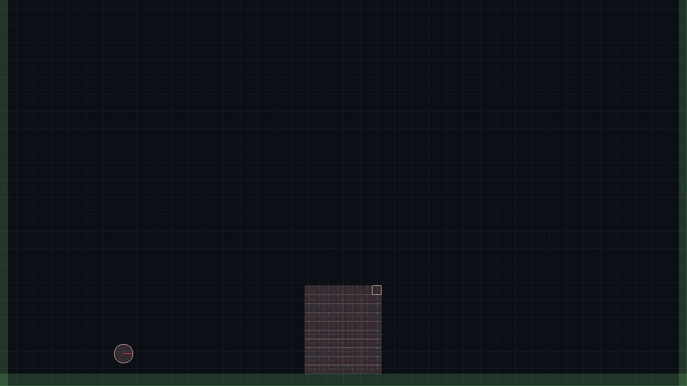
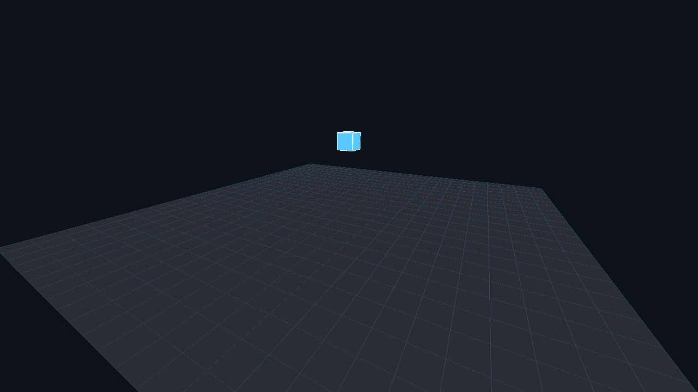
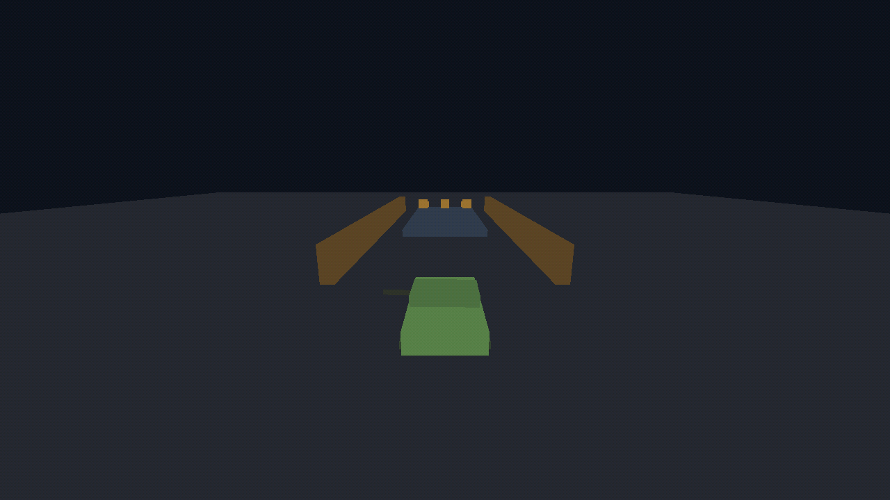

# BuGL

> **Learn graphics programming with real APIs — without the C++ boilerplate.**

BuGL is a scripting-first graphics runtime built on [BuLang](https://github.com/akadjoker/BuLangVM).  
Write OpenGL demos in minutes. From immediate mode triangles to ray tracers with reflections.

---

## Gallery

| Ray Tracer | Bloom + HDR | Particles |
|:-:|:-:|:-:|
|  |  |  |
| Reflections · refraction · Fresnel · 8 bounces | 3-pass render pipeline · tone mapping | 50k particles · physics · additive blending |

| Ray Marching | Terrain | Box2D |
|:-:|:-:|:-:|
|  |  |  |
| SDF · smooth union · soft shadows · AO · fog | FBM heightmap · 32k triangles · fog | 2D rigid body · mouse joint drag |

| ODE Car | ODE Fall 3D | Box2D Stack |
|:-:|:-:|:-:|
|  |  |  |
| Hinge2 joints · steering · suspension | 3D rigid body · collision contacts | 2D stacking · impulses · stability |

| Jolt Vehicle | Jolt Motorcycle | Jolt Tank |
|:-:|:-:|:-:|
|  |  |  |
| Wheeled vehicle · suspension · collision course | Motorcycle controller · follow camera · jumps | Tracked vehicle · turret aim · shell explosions |

---

## Quick Start

**Dependencies:**
```bash
# Ubuntu / Debian
sudo apt install cmake libsdl2-dev libgl-dev

# macOS
brew install cmake sdl2
```

**Build and run:**
```bash
git clone https://github.com/akadjoker/BuGL
cd BuGL
cmake -S . -B build && cmake --build build -j
./bin/main scripts/tutor_1.bu
```

---

## Why BuGL?

Opening a window with OpenGL in C++ takes 80+ lines before you see a single triangle.  
In BuGL:

```javascript
SetGLVersion(3, 3, SDL_GL_CONTEXT_PROFILE_CORE);
Init("Demo", 1280, 720, SDL_WINDOW_OPENGL);

while (Running())
{
    glClear(GL_COLOR_BUFFER_BIT);
    // your code here
    Flip();
}
```

The focus stays on the **concepts** — shaders, buffers, matrices, physics — not fighting the compiler.

---

## Learning Path

Follow the tutorials in order. Each one introduces a single new concept:

| Script | What you learn |
|--------|----------------|
| `tutor_1.bu` | Legacy OpenGL · `glBegin/glEnd` · immediate mode |
| `tutor_2.bu` | Client arrays · `glVertexPointer` · `glDrawArrays` |
| `tutor_3.bu` | VBO · vertex shader · fragment shader |
| `tutor_4.bu` | VAO · camera · MVP matrix · 3D grid |
| `tutor_5.bu` | FPS camera · mouse look · WASD · GIF capture |
| `tutor_6.bu` | 2D text · TrueType · texture atlas |

---

## Demos

After the tutorials, explore the demos:

| Demo | Concepts |
|------|----------|
| `demo_texture_quad.bu` | Textures · UV coords · sampler2D · `glTexImage2D` |
| `demo_phong.bu` | Phong shading · normals · point light |
| `demo_particles.bu` | 50k particles · `glBufferSubData` · additive blending |
| `demo_terrain.bu` | FBM heightmap · fog · altitude-based colour |
| `demo_bloom_hdr.bu` | FBO · MRT · Gaussian blur · HDR tone mapping |
| `demo_raymarching.bu` | SDF · smooth union · soft shadows · AO |
| `demo_raytrace.bu` | Ray tracing · reflection · refraction · Fresnel · 8 bounces |
| `demo_shader_hotreload.bu` | Live shader hot reload |
| `demo_audio.bu` | Audio IDs · SFX playback · procedural waveforms |
| `demo_box2d_stack.bu` | Box2D · rigid bodies · stacking |
| `demo_box2d_mouse_joint.bu` | Box2D · mouse joint · interactive drag |
| `demo_box2d_edge_chain.bu` | Box2D · edge chain · 2D terrain |
| `demo_ode_fall3d.bu` | ODE · 3D physics · plane collision |
| `demo_ode_car.bu` | ODE · hinge2 car · suspension |
| `demo_jolt_vehicle_wheeled.bu` | Jolt · wheeled vehicle · suspension · obstacles |
| `demo_jolt_motorcycle.bu` | Jolt · motorcycle controller · ramp · follow camera |
| `demo_jolt_tank.bu` | Jolt · tracked vehicle · turret control · explosions |

All demos support **F12** to record a GIF.

---

## Modules

### `SDL` — window, input, GL context

```javascript
SetGLVersion(3, 3, SDL_GL_CONTEXT_PROFILE_CORE);
SetGLAttribute(SDL_GL_DOUBLEBUFFER, 1);
Init("Title", 1280, 720, SDL_WINDOW_OPENGL | SDL_WINDOW_RESIZABLE);

while (Running())
{
    var dt = GetDeltaTime();
    var (mx, my) = GetMouseDelta();
    if (IsKeyDown(KEY_ESCAPE)) Quit();
    if (IsKeyPressed(KEY_F12)) SaveScreenshot("frame.png");
    Flip();
}
```

### `OpenGl` — the full OpenGL API

```javascript
GLDebug(true);
var prog = LoadShaderProgram("vert.glsl", "frag.glsl"); // auto hot reload

while (Running())
{
    glUseProgram(prog);   // reloads shader if file changed on disk
    GLCheck("after draw");
    Flip();
}
```

Includes: core state · legacy fixed pipeline · VBO/VAO/EBO · textures · shaders · uniforms · instancing · UBO · render targets · queries.

### `STB` — images, fonts, GIF

```javascript
var font = Font();
font.load("assets/arial.ttf", 32);
font.drawText("Hello BuGL", 10, 10, 1.0, 1.0, 1.0);

var gif = Gif();
gif.begin(640, 360);
gif.addFrame(pixels, 4, 16, -width * 4);
gif.save("output.gif");
```

### `Audio` — music + SFX by integer ID

```javascript
import Audio;
using Audio;

AudioInit();
var sfx = AudioLoadSfx("assets/audio/click.wav");
AudioPlaySfx(sfx, 1.0, 1.0, 0.0);
AudioUpdate();
AudioClose();
```

### `Box2D` — 2D physics

```javascript
// 1. Initialize the Box2D world with gravity
var world = B2World(0.0, -20.0);

// 2. Define and create a dynamic body
var bd = B2BodyDef();
bd.setType(B2_DYNAMIC_BODY);
bd.setPosition(x, y);
var body = world.createBody(bd);

// 3. Define the shape and physical properties (Fixture)
var shape = B2PolygonShape();
shape.setAsBox(width, height);

var fd = B2FixtureDef();
fd.setShape(shape);
fd.setDensity(1.0);
fd.setFriction(0.35);
body.createFixture(fd);

// 4. Advance the simulation (Step)
world.step(1.0 / 60.0, 8, 3);

// 5. Get the new position using multiple assignment
var (bx, by) = body.getPosition();
```

### `ODE` — 3D physics

```javascript
dInitODE2(0);
var world = dWorldCreate();
var space = dSimpleSpaceCreate(nil);
dWorldSetGravity(world, 0.0, -9.81, 0.0);
var body = dBodyCreate(world);
dGeomSetBody(dCreateBox(space, w, h, d), body);
```

---

## Data Types for GPU Uploads

Three ways to send data to OpenGL:

```javascript
// 1. Fixed-size buffer — good for static data
var pixels = @(width * height * 4, 0);

// 2. Typed array — good for dynamic geometry
var verts = Float32Array(1000);
verts.add(x, y, z,  r, g, b);
glBufferData(GL_ARRAY_BUFFER, verts.byteLength(), verts, GL_STATIC_DRAW);

// 3. Partial update — good for particles / skinning
glBufferSubData(GL_ARRAY_BUFFER, 0, verts.byteLength(), verts);
```

Available types: `Uint8Array` · `Int16Array` · `Uint16Array` · `Int32Array` · `Uint32Array` · `Float32Array` · `Float64Array`

---

## Project Layout

```
BuGL/
├── bin/                      compiled binary
├── scripts/
│   ├── tutor_1.bu            learning path
│   ├── ...
│   └── demo_raytrace.bu      advanced demos
├── assets/
│   ├── shaders/              .vert / .frag for hot reload
│   ├── fonts/
│   └── gifs/                 GIFs captured with F12
└── main/src/
    ├── imopengl.cpp          OpenGL core + matrix ops
    ├── opengl_shader.cpp     shaders + uniforms + hot reload
    ├── opengl_rendertarget.cpp
    ├── stb_bindings.cpp      images + fonts + GIF
    ├── box2d_bindings.cpp    2D physics
    └── ode_bindings.cpp      3D physics
```

---

## Build

```bash
cmake -S . -B build
cmake --build build -j
```

```bash
./bin/main scripts/tutor_1.bu   # run a script directly
./bin/main scripts/main.bu      # launcher with menu
```

---

## Links

- **BuLang VM** — https://github.com/akadjoker/BuLangVM
- **License** — MIT
- **Contributing** — [CONTRIBUTING.md](CONTRIBUTING.md)
