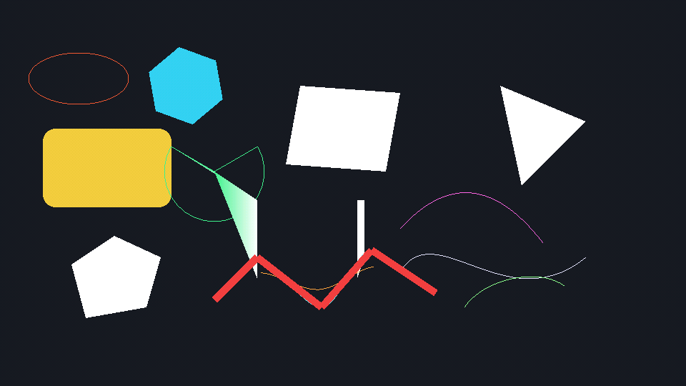
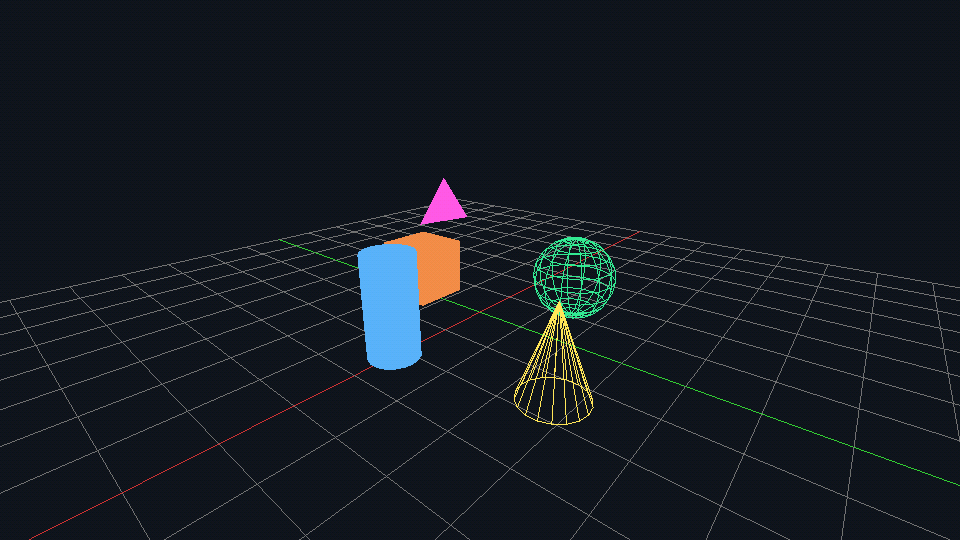
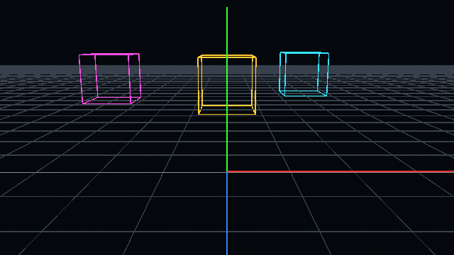

# BuGL

> Real graphics APIs, scripted in BuLang.

BuGL is a scripting-first runtime for graphics/gameplay experiments.
You write `.bu` scripts and call modules like `SDL`, `OpenGl`, `Batch`, `SpriteFont`, physics, and tools directly.

## If You Know Nothing Yet

Start here:

```bash
git clone https://github.com/akadjoker/BuGL
cd BuGL
cmake -S . -B build
cmake --build build -j
./bin/bugl scripts/tutor_1.bu
```

If that runs, continue with:

1. `./bin/bugl scripts/tutor_3.bu`
2. `./bin/bugl scripts/tutor_6.bu`
3. `./bin/bugl scripts/demo_jolt_tank_csm_particles.bu`

## What BuGL Is

- `BuLang` = language (syntax, flow control, arrays, classes).
- `BuGL` = runtime modules exposed to BuLang.
- Typical loop in scripts: `Init -> while (Running) -> update -> draw -> Flip`.

You can prototype rendering and gameplay logic fast, without C++ boilerplate in each demo.

## Plugin-Based Runtime

BuGL uses plugins for bigger feature groups.  
At runtime, scripts load what they need (`require "Jolt"`, etc.).

Main plugin modules:

| Plugin | Module in script | Typical usage |
|------|------|------|
| `BuJolt` | `Jolt` | 3D vehicles, rigid bodies, constraints |
| `BuOde` | `ODE` | 3D rigid body simulation |
| `BuBox2d` | `Box2D` | 2D physics |
| `BuChipmunk` | `Chipmunk` | Alternative 2D physics |
| `BuRecast` | `Recast` | Navmesh + crowd/pathing |
| `BuOpenSteer` | `OpenSteer` | Steering behaviors |
| `BuMicroPather` | `MicroPather` | Grid/pathfinding |
| `BuAssimp` | `Assimp` | 3D model loading |

Plugin binaries are in `bin/plugins/`.

## Gallery

| Ray Tracer | Bloom + HDR | Particles |
|:-:|:-:|:-:|
|  |  |  |
| Reflections · refraction · Fresnel | Multi-pass HDR + bloom | High-count particle rendering |

| Ray Marching | Terrain | Box2D |
|:-:|:-:|:-:|
|  |  |  |
| SDF + lighting | Procedural terrain | 2D physics interaction |

| ODE Car | ODE Fall 3D | Box2D Stack |
|:-:|:-:|:-:|
|  |  |  |
| Car physics | 3D rigid body collisions | Stack stability |

| Jolt Vehicle | Jolt Motorcycle | Jolt Tank |
|:-:|:-:|:-:|
|  |  |  |
| Wheeled vehicle controller | Bike controller | Tracked tank + turret |

| Portal Showcase | ImGui Components | Batch Lines |
|:-:|:-:|:-:|
|  |  |  |
| Render-to-texture portal | ImGui widgets/bindings | 2D Batch primitives |

| Batch 3D Primitives | Tank CSM + Sparks | Tutor 5 Capture |
|:-:|:-:|:-:|
|  |  |  |
| 3D primitives with Batch | Jolt + cascaded shadows + particles | FPS camera tutorial |

## Learning Path

Tutorials:

1. `scripts/tutor_1.bu` (window + loop + basic draw)
2. `scripts/tutor_2.bu` (arrays/buffers basics)
3. `scripts/tutor_3.bu` (shader + VBO flow)
4. `scripts/tutor_4.bu` (camera + matrix usage)
5. `scripts/tutor_5.bu` (FPS controls + capture workflow)
6. `scripts/tutor_6.bu` (text/font flow)

Then demos by topic:

- Rendering: `demo_phong.bu`, `demo_texture_quad.bu`, `demo_bloom_hdr.bu`
- Advanced visuals: `demo_raymarching.bu`, `demo_raytrace.bu`, `demo_shadowmap_csm_v3.bu`
- Physics: `demo_jolt_*`, `demo_ode_*`, `demo_box2d_*`
- UI/tools: `demo_imgui.bu`, `test_imgui_widgets_smoke.bu`, `test_font.bu`

## API Orientation

Start with these files:

1. [API.md](API.md): central API reference.
2. [`scripts/`](scripts): runnable examples for each subsystem.
3. [`scripts/demo_jolt_tank_csm_particles.bu`](scripts/demo_jolt_tank_csm_particles.bu): full release-style scene.

## Build

```bash
cmake -S . -B build
cmake --build build -j
```

Run scripts:

```bash
./bin/bugl scripts/tutor_1.bu
./bin/bugl scripts/main.bu
```

## Common Commands

```bash
# run main release demo
./bin/bugl scripts/demo_jolt_tank_csm_particles.bu

# run ImGui widget smoke
./bin/bugl scripts/test_imgui_widgets_smoke.bu
```

## Notes

- GIF capture hotkey in runtime is `F10`.
- Most demo scripts also include their own controls in header comments.

## Links

- BuLang VM: https://github.com/akadjoker/BuLangVM
- API reference: [API.md](API.md)
- Contributing: [CONTRIBUTING.md](CONTRIBUTING.md)
- License: MIT
